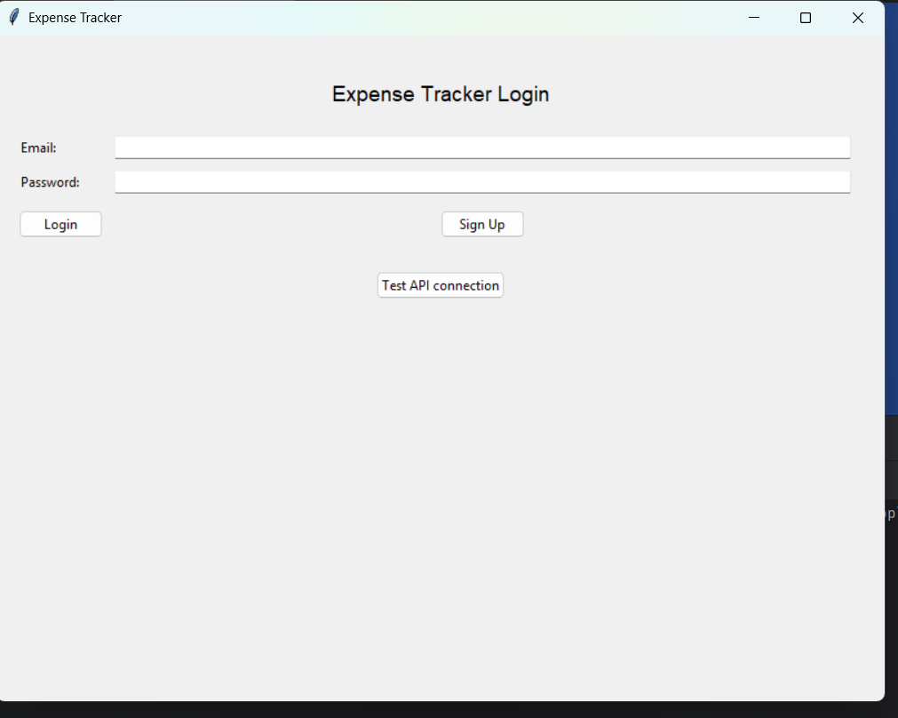
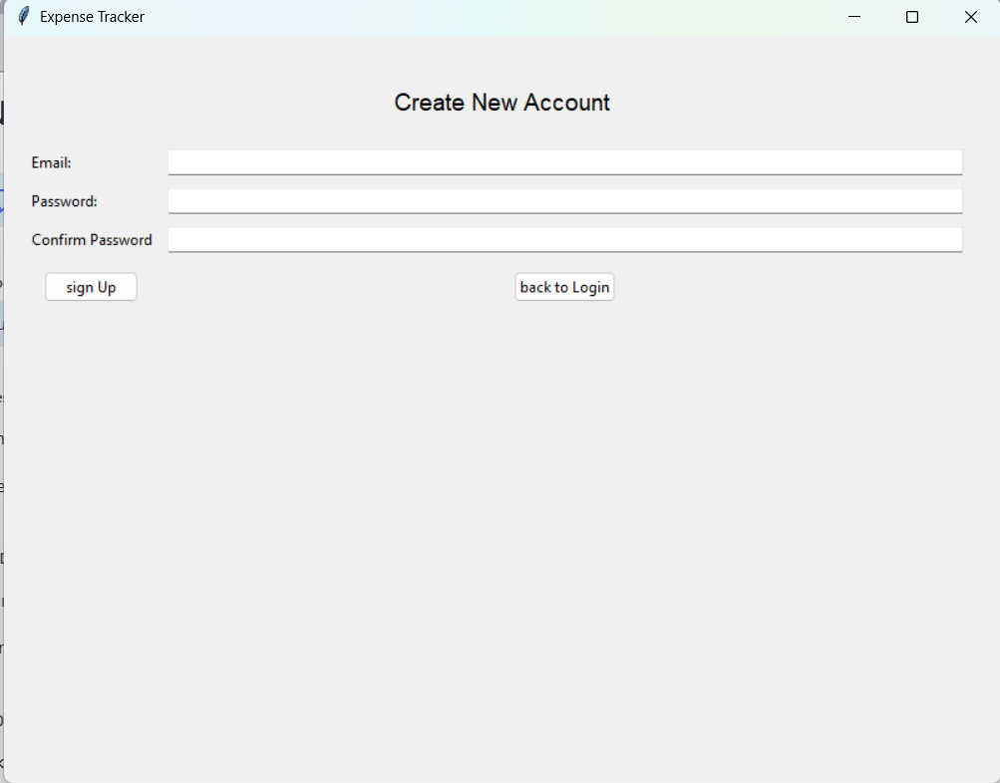
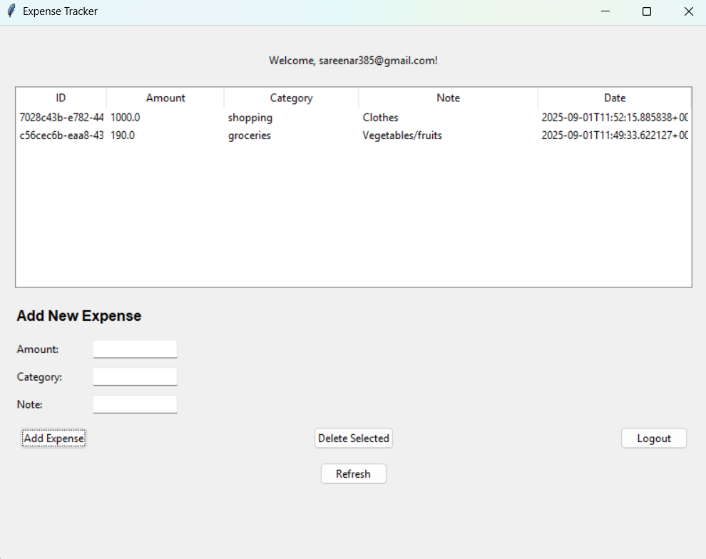
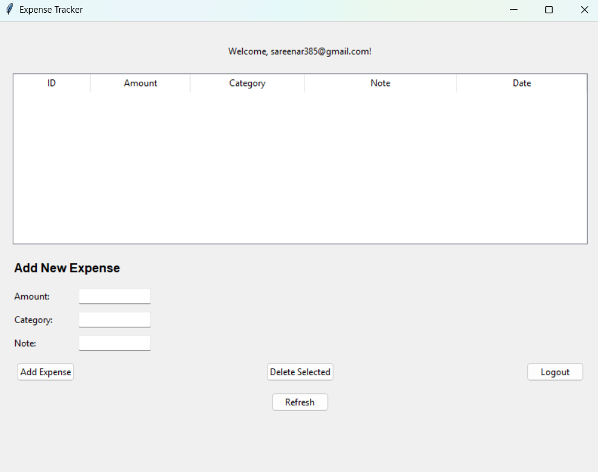

# 💰 Expense Tracker

A multi-user desktop expense tracking application with secure authentication and real-time expense management. Built with FastAPI, Supabase, and Python Tkinter.

## 📸 Application Screenshots

### Authentication
| Login Screen | Signup Form |
|--------------|-------------|
|  |  |

### Expense Management  
| Dashboard | Add Expense |
|-----------|-------------|
|  |  |

## ✨ Features

- **Multi-user authentication** with secure login/signup
- **Real-time expense management** - add, view, delete expenses  
- **Category-based tracking** (Food, Transport, Entertainment, etc.)
- **Cloud database** with automatic sync
- **Desktop GUI** with clean interface
- **RESTful API** supporting multiple users

## 🛠️ Tech Stack

- **Backend:** FastAPI + Python
- **Database:** Supabase (PostgreSQL)  
- **Frontend:** Python Tkinter
- **Authentication:** Supabase Auth with JWT tokens

## 📁 Project Structure
```
desktop_expense_tracker/
├── screenshots/
│   ├── login.png
│   ├── signup.png
│   ├── dashboard.png
│   └── add-expense.png
├── backend/
│   ├── main.py
│   └── api.py
├── frontend/
│   └── app.py
├── .env
├── requirements.txt
└── README.md
```

## 🚀 Installation & Setup

### Prerequisites
- Python 3.8+
- Supabase account

### 1. Clone & Install
```bash
git clone https://github.com/sareena-rahim/expense-tracker.git
cd expense-tracker
pip install -r requirements.txt
```

### 2. Supabase Setup
1. Create a project at [supabase.com](https://supabase.com)
2. Create the expenses table in SQL Editor:

```sql
CREATE TABLE IF NOT EXISTS expenses (
    id UUID PRIMARY KEY DEFAULT gen_random_uuid(),
    user_id UUID REFERENCES auth.users(id) ON DELETE CASCADE,
    amount NUMERIC NOT NULL,
    category TEXT NOT NULL,
    note TEXT,
    date TIMESTAMP WITH TIME ZONE DEFAULT now()
);
```

### 3. Environment Configuration
Create `.env` file:
```env
SUPABASE_URL=your_supabase_project_url
SUPABASE_ANON_KEY=your_supabase_anon_key
SUPABASE_SERVICE_ROLE_KEY=your_service_role_key
```

### 4. Run the Application

**Start Backend:**
```bash
cd backend
python api.py
```

**Start Desktop App:**
```bash
cd frontend  
python app.py
```

## 📊 API Endpoints

| Method | Endpoint | Description |
|--------|----------|-------------|
| `POST` | `/signup` | Register new user |
| `POST` | `/login` | User login |
| `GET` | `/me` | Get current user |
| `POST` | `/expense` | Add new expense |
| `GET` | `/expenses` | Get user expenses |
| `DELETE` | `/expense/{id}` | Delete expense |

Visit `http://localhost:8000/docs` for interactive API documentation.

## 🧪 Testing

The desktop app provides a complete interface for all functionality. For API testing, visit `http://localhost:8000/docs` for interactive documentation.

---
